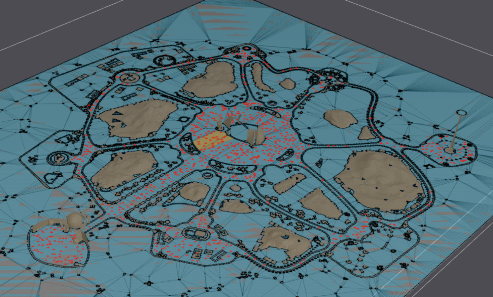

# Recast Navigation
Recast Navigation是一个基于A*算法的导航工具，用于地图模型中的自动寻路，包括多路径寻路。工具分为两部分：Recast & Detour。

<small>详细文档请阅读原[README](README_ori.md).  
本工具来源于：https://github.com/recastnavigation/recastnavigation/ </small>

## 简介
Recast部分会给导入的3D地图模型（.obj）建模，首先建立voxel mold，然后将地图分成多个区域，最终将每个区域转化为多个多边形的组合。 
Detour部分中实现在多边形tile中的导航。 
RecastDemo是一个GUI的可视化demo，展示了整个工具的所有功能。

## 如何使用

针对不同操作系统使用premake进行预编译，然后再编译后执行。Win可执行文件在RecastDemo下的Bin中。 
### 多路径寻路
将地图文件（.obj）放入Meshes目录下，将test文件放入TestCases目录下，test中每一行均为起终点的坐标，行的数量代表了期望的多路径寻路结果数量。 
具体载入地图文件（.obj）的参数和寻路路径数量上限均在分别在Sample和TestCase以参数的形式设置。 
多路径寻路的结果将会保存至Result文件夹下。 
**UPDATE：加入了路径偏移以及对漏斗平滑算法的扰动，具体扰动和偏移参数需要在code中调整。**

### 随机选择NPC出生点
打开编译好的RecastDemo，选择solomesh和需要的地图文件（.obj），build或者load之后左侧选择make random spawn points。 
现在可以设置密度、障碍物忽略及走廊地形识别。
**NOTE：具体参数和是否过滤需要在code中调整。**

## 预览

